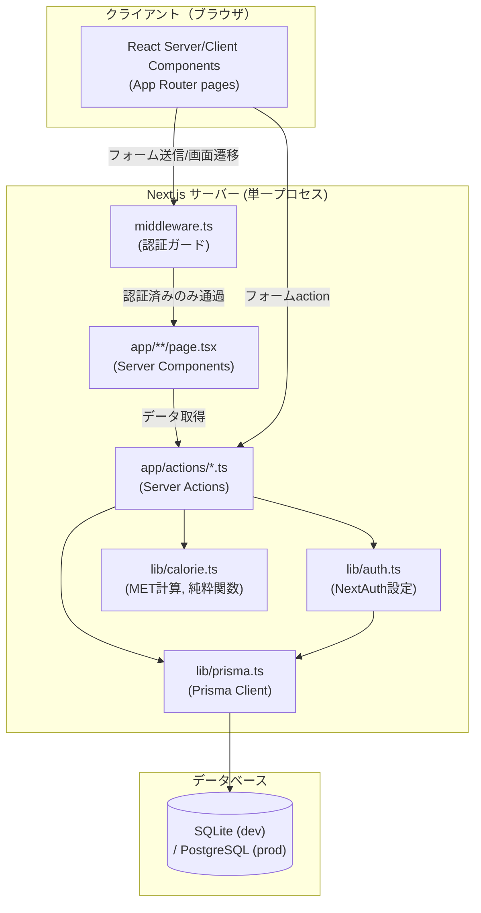
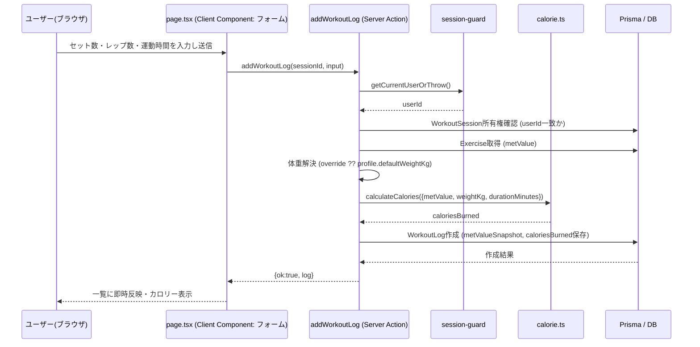

# 基本設計書: ジムトレーニング消費カロリー管理システム（MuscleBoost）

前提: `requirements.md` の要件・設計判断（特に第5章の確定事項）を満たす構成とする。

---

## 1. 技術スタック（決定）

| 領域 | 採用技術 | 選定理由 |
|---|---|---|
| フレームワーク | Next.js 15.x (App Router) | 環境内の全プロジェクトがNext.jsを採用（BrainGame, civilserviceapp）。App RouterはServer Actionsで認可チェックを1箇所に集約しやすい。 |
| 言語 | TypeScript 5.x | 型安全なMET計算・DTO設計のため（他プロジェクトも全てTS）。 |
| UI | React 19 + Tailwind CSS v4 | civilserviceapp（最新実績）に合わせる。Tailwind v4はconfigファイル無しでも動作し初期セットアップが速い。 |
| ORM | Prisma 6.x | 型安全なDBアクセス。SQLite→PostgreSQL移行が容易（研究レポートの推奨候補）。 |
| DB（開発） | SQLite（ファイルDB, `prisma/dev.db`） | セットアップが最も速く個人開発に適する。 |
| DB（本番想定） | PostgreSQL | `DATABASE_URL` とPrismaの`provider`切替のみで移行可能な設計にする（詳細はdetailed-designの注意事項）。 |
| 認証 | Auth.js (NextAuth) v5, Credentials Provider + JWTセッション | 自前でユーザーテーブルを持ち、複数ユーザーのログイン・データ分離を完全制御。OAuthは不要なためPrismaAdapterは使わずシンプルに構成。 |
| パスワードハッシュ | bcryptjs | Windows環境でのネイティブビルド問題を避けるため`bcrypt`ではなく`bcryptjs`を採用。 |
| バリデーション | Zod | Server Actionの入力検証を型と同時に行う。 |
| テスト | Vitest（ユニット: カロリー計算等）＋ Playwright（E2E、BrainGame実績を踏襲） | ロジックの単体テストとブラウザE2Eを分離。 |

### 1.1 重要な技術的注意（SQLiteとPrisma enum）
Prisma + SQLiteコネクタは `enum` 型をサポートしない（PostgreSQL移行を前提とするならenumを使うとSQLite開発時にエラーとなる）。そのため **強度カテゴリ・部位区分はPrisma上は `String` カラムとし、アプリケーション層のTypeScript Union型 + Zodでバリデーションする**。これによりSQLite/PostgreSQLどちらでもスキーマ変更なしに動作する。

---

## 2. 全体アーキテクチャ



### 2.1 モジュール分割

| モジュール | 責務 |
|---|---|
| `app/*` (Pages, Server Components) | 画面表示、初期データ取得（Server Component内で直接Prisma/Actionsを呼ぶ） |
| `app/actions/*` (Server Actions) | フォーム送信の受け口。バリデーション→認可チェック→ドメインロジック呼び出し→DB更新→結果返却 |
| `lib/auth.ts` | NextAuth設定、`auth()` ヘルパー（現在のセッション取得） |
| `lib/session-guard.ts` | 「ログイン必須」「所有権チェック」を共通化するヘルパー |
| `lib/calorie.ts` | MET計算式（副作用なしの純粋関数、ユニットテスト対象） |
| `lib/prisma.ts` | Prisma Clientのシングルトン |
| `lib/validation.ts` | Zodスキーマ集約 |
| `types/*` | ドメイン型・DTO・Union型（MuscleGroup, IntensityCategory等） |
| `components/*` | 再利用UIパーツ（フォーム、カード、注記バナー等） |
| `prisma/schema.prisma` | データモデル定義 |
| `prisma/seed.ts` | マシンマスタ初期データ投入 |

### 2.2 データフロー（トレーニング記録保存の例）



### 2.3 認証・認可フロー

```mermaid
graph LR
    A[リクエスト] --> B{middleware.ts<br/>セッションCookie検証}
    B -- 未ログイン かつ 保護パス --> C[/login へリダイレクト/]
    B -- ログイン済み or 公開パス --> D[ページ/Server Action実行]
    D --> E{Server Action内<br/>所有権チェック}
    E -- userId不一致 --> F[エラー返却 (403相当)]
    E -- userId一致 --> G[DB操作実行]
```

---

## 3. 画面構成（サイトマップ）

| パス | 認証要否 | 概要 |
|---|---|---|
| `/login` | 不要 | ログイン画面 |
| `/register` | 不要 | 新規登録画面 |
| `/` | 必要 | ダッシュボード（週間/月間集計、直近記録） |
| `/workouts` | 必要 | ワークアウトセッション一覧（履歴） |
| `/workouts/new` | 必要 | 新規セッション作成＋マシン記録追加 |
| `/workouts/[id]` | 必要 | セッション詳細（記録編集・削除） |
| `/exercises` | 必要 | マシン（エクササイズ）マスタ一覧・絞り込み |
| `/exercises/new` | 必要 | カスタムマシン追加 |
| `/profile` | 必要 | プロフィール（表示名・デフォルト体重・体重履歴） |

## 4. 外部インターフェース（Server Actions I/F 一覧）

Server Actionsを「API」として扱う（REST APIは`app/api/auth/[...nextauth]/route.ts`のみ、それ以外は全てServer Actions経由）。詳細な型・シグネチャは `detailed-design.md` で確定する。

| Action | 用途 |
|---|---|
| `registerAction` | ユーザー新規登録 |
| `listExercises` / `createExercise` / `deleteCustomExercise` | マシンマスタ参照・カスタム追加・削除 |
| `createWorkoutSession` / `deleteWorkoutSession` / `listWorkoutSessions` / `getWorkoutSession` | セッションCRUD |
| `addWorkoutLog` / `updateWorkoutLog` / `deleteWorkoutLog` | ログCRUD（保存時にカロリー自動計算） |
| `updateProfile` / `addWeightLog` / `listWeightLogs` | プロフィール・体重履歴 |
| `getDashboardStats` | 週間/月間集計取得 |

## 5. データストア方針
- 開発: `prisma/dev.db`（SQLite）。`npx prisma migrate dev` でスキーマ適用、`npx prisma db seed` でマスタ投入。
- 本番移行時: `schema.prisma` の `datasource.provider` を `postgresql` に変更し `DATABASE_URL` を接続文字列に変更するのみ（enumを使わない設計のため追加変更不要）。

## 6. 非機能面の設計対応
- セキュリティ: 全Server Actionの先頭で `getCurrentUserOrThrow()` を呼び、以降のDBクエリは必ず `where: { userId: currentUser.id, ... }` を含める（横断的な所有権チェック規約）。
- 可搬性: Prisma enum不使用、DB固有関数不使用。
- テスト容易性: `lib/calorie.ts` は入出力のみに依存する純粋関数とし、DB・認証から完全に分離する。
