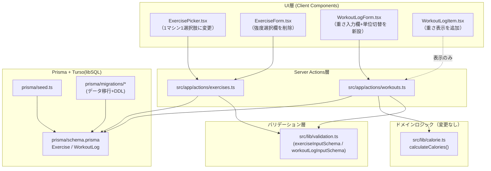
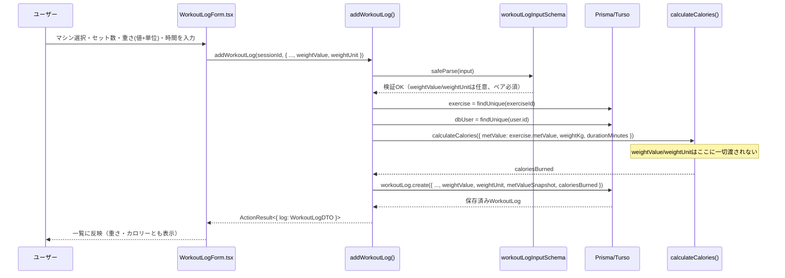
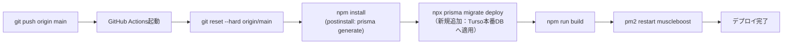

# 基本設計書: マシン選択肢の統一と重量記録欄の新設（MuscleBoost）

## 0. 参照
- `requirements.md`（本プロジェクト）
- 情報収集レポート: `C:\project\MuscleBoost\.project\research\topics\2026-09-14-1040-machine-weight-input.md`（比較表A・Bの出典）

---

## 1. 全体アーキテクチャ

既存アーキテクチャ（Next.js App Router + Server Actions + Prisma + Turso libSQL）は変更しない。影響は「マシンマスタのデータモデル」と「トレーニング記録の入力・保存・表示」の2系統に閉じる。

- 重さフィールドはカロリー計算ドメイン（`calorie.ts`）を一切通過しない。データフロー上も `WorkoutLogForm.tsx → addWorkoutLog/updateWorkoutLog → prisma.workoutLog.create/update` という保存経路のみを通り、`calculateCalories()` の呼び出し引数には含まれない。

## 2. 強度レベル統合の方針（確定）

### 2.1 比較（情報収集レポートより転記）

| 候補 | 概要 | 推奨度 |
|---|---|---|
| A1 | MODERATEを代表値に統合、他は削除 | ★★★☆☆ |
| A2 | スキーマは残し、UI側だけ代表1件に絞る（暫定対応） | ★★☆☆☆ |
| A3 | 完全統合＋既存WorkoutLogのexerciseId re-point、metValueSnapshotの不変性を活用 | ★★★★☆ |
| A4 | 新マスタ新設＋旧36件はアーカイブフラグで温存 | ★★★☆☆ |

### 2.2 選定: **A3（完全統合）**

**理由:**
1. ユーザー要望「1マシン=1選択肢」に最も忠実に応えられるのはA3（A1と同じ最終形だが、削除ではなく「代表IDへの再ポイント＋クリーンアップ」という安全な手順を取る点でA1より工程が明確）。
2. `WorkoutLog.metValueSnapshot` と `caloriesBurned` が記録時点の値としてスナップショット保存される既存設計（`src/app/actions/workouts.ts` で確認済み）のおかげで、マスタのMET値を将来統合・変更しても**過去記録のカロリー表示は一切変わらない**。この既存の後方互換性を活かせるため、A3のデメリットとして懸念される「過去ログの意味が変わる」問題は実質的に発生しない。
3. A2（UI側のみ絞り込み）は「同じマシン名で複数レコードが裏に残る」技術的負債を温存し、将来のマシン追加時の混乱要因になるため却下。
4. A4（アーカイブ方式）はデータ移行が不要という利点はあるが、`isArchived` 相当の新フラグ導入で `listExercises` のフィルタ条件が複雑化し、「1マシン1エントリ」という要件に対してマスタテーブルの実体が追随しない（技術的負債が残る）ため、今回は不採用。ただし本番データの実データ件数が非常に多く移行リスクが許容できないと判明した場合の代替案として記録だけ残す。

### 2.3 具体的な統合ルール

- 対象: 筋トレマシン10種（`STRENGTH_MACHINES`）。各マシンにつき既存 `LIGHT`/`MODERATE`/`VIGOROUS` の3レコードが存在する。
- **代表レコードとして `MODERATE`（`seed-${machine.name}-MODERATE`, metValue=5.5）のIDをそのまま流用する。** LIGHT/VIGOROUSは削除する。
  - 理由: 代表IDを新規発行せず既存IDを流用することで、再ポイントが必要なのは「LIGHT・VIGOROUSを参照していたWorkoutLog」のみに限定でき、影響範囲が最小化される（情報収集レポートの「設計者への申し送り」に基づく）。
- 代表レコードの `name` は強度サフィックス（「（中等度）」等）を除去し、素のマシン名（例:「チェストプレス」）に更新する。
- `intensityCategory` フィールドは **Exerciseモデルから完全に削除する**（スキーマからカラムごと削除）。
  - 理由: 「強度」という概念自体がマシン選択の分岐要因ではなくなるため、フィールドを残すと将来「結局これは何のための値か」という混乱を招く。cardio機種も含め、強度分類はマシン名・説明文・MET値で十分表現されている（例:「エアロバイク（90〜100W）」）。
  - トレードオフとして、有酸素マシンの「強度ラベル」表示（プルダウン内の「/ 高強度 /」等の文言）は無くなるが、MET値自体は個別に保持されるため情報の実質的な損失はない。
- 有酸素マシン6件（`CARDIO_MACHINES`）はレコード数・ID・MET値とも変更なし（元々1マシン1エントリのため対象外）。カラム削除の影響（intensityCategoryが読めなくなる）のみ受ける。
- カスタムマシン（`isCustom=true`）も同様に `intensityCategory` 列が失われる。マイマシン作成フォーム（`ExerciseForm.tsx`）・`exerciseInputSchema` から強度選択欄を削除する（スキーマ変更に伴う必然的な追随。要件 FR-8）。

## 3. 重量フィールドのスキーマ方針（確定）

### 3.1 比較（情報収集レポートより転記）

| 候補 | 概要 | 推奨度 |
|---|---|---|
| B1 | `weightValue Float?` + `weightUnit String?`（MuscleGroup等と同一パターン） | ★★★★☆ |
| B2 | 常にKGへ正規化して`weightKg Float?`のみ保存、表示時に換算 | ★★★☆☆ |
| B3 | `weightKg Float?` + `weightLb Float?` の2カラム | ★★☆☆☆ |

### 3.2 選定: **B1**

**理由:**
1. ユーザー要望は「重さの値はカロリー計算には一切使わない。記録用（保存・表示）のみ」であり、集計・グラフ化用途は明示的にスコープ外。したがってB2の利点（正規化による将来集計の容易さ）は今回の要件に対する優先度が低く、逆にB2の欠点（丸め誤差により「135lbと入力したのに表示が135lbに戻らない」ことがある）は「記録用のみ」という要望の趣旨に反する。
2. B3（2カラム）はどちらか一方のみ値を持つという制約をアプリ層でしか担保できず、DB制約で保証できないためデータ不整合のリスクが増える。
3. B1は既存の `MuscleGroup`/`IntensityCategory`（Prisma上は`String`、TS側で `as const` 配列 + Zod `enum` + `Record`ラベル）と同一の実装パターンを踏襲でき、学習コスト・実装コストが最も低い。
4. **単位変換は行わない**（NFR-5）。UIの単位切り替え（KG/ポンド）は「これから入力する値の単位を選ぶ」ためのものであり、既入力値の自動再計算は行わない。理由は上記の丸め誤差リスク回避と、要件が「記録用のみ」であるためシンプルさを優先する。

### 3.3 フィールド定義

- `WorkoutLog.weightValue: Float?`（未入力時 `null`）
- `WorkoutLog.weightUnit: String?`（実質的に `"KG" | "LB"`。未入力時 `null`）
- アプリ層の制約: 2つのフィールドは常にペアで存在する（片方だけ値がある状態を許さない）。Zodの `superRefine` でバリデーションする（詳細は `detailed-design.md`）。

## 4. 既存 WorkoutLog.exerciseId 再ポイント方針（確定）

- **タイミング**: マイグレーションSQL内で、スキーマDDL変更（`intensityCategory`列削除等）より **前** に実行する。
  - 理由: SQLiteは列削除時にテーブル再作成（`PRAGMA foreign_keys=OFF` → 新テーブル作成 → コピー → 旧テーブルDROP → RENAME）を要するが、そのDDLとは独立して、**FK制約（`onDelete: Restrict`）がまだ有効な段階で** 安全にUPDATE→DELETEの順に処理を完了させておくことで、「削除しようとしたら制約違反で失敗した」という事故を構造的に防げる。
- **手順**:
  1. 対象10マシンそれぞれについて、`WorkoutLog.exerciseId` が `LIGHT` または `VIGOROUS` の seed IDを指している行を、`MODERATE` の seed ID（代表ID、変更なし）へ `UPDATE` する。
  2. 再ポイント完了後、`LIGHT`/`VIGOROUS` の `Exercise` 行を `DELETE`（もう何も参照していないため `onDelete: Restrict` に抵触しない）。
  3. 代表行（`MODERATE`）の `name` から強度サフィックスを除去する `UPDATE`。
  4. その後にPrisma生成のDDL（列削除の再構築、`WorkoutLog`への列追加）を適用する。
- **影響評価**: `metValueSnapshot`・`caloriesBurned` は各 `WorkoutLog` 行に既にコピー保存済みのため、`exerciseId` の付け替え自体はカロリー表示に一切影響しない。表示上変わるのは `exerciseName`（`exercise.name` を都度JOINして取得するため）のみで、再ポイント後は代表マシン名（強度サフィックス無し）が表示される。これは統合の意図した結果であり、過去ログの整合性上も問題ない（「その日その強度で行った」という情報はそもそも`intensityCategory`列自体が削除されるため、どのみち保持されない）。
- **カスタムマシン（`isCustom=true`）**: 統合・再ポイントの対象外。ユーザー自身が作成した行はそのまま残る（名称重複チェックの対象にもしない）。

## 5. データフロー（記録作成シーケンス）

## 6. モジュール分割 / I/F定義

| モジュール | 責務 | 変更内容 |
|---|---|---|
| `prisma/schema.prisma` | データモデル定義 | `Exercise.intensityCategory` 削除、`WorkoutLog.weightValue`/`weightUnit` 追加 |
| `prisma/seed.ts` | 初期データ投入 | 筋トレ10機種を1エントリ化（MODERATE IDを流用） |
| `prisma/migrations/*` | スキーマ・データ移行 | 再ポイント→削除→リネーム→DDL の順で実行するSQL |
| `src/types/index.ts` | 型定義・定数 | `IntensityCategory`関連を削除、`WeightUnit`関連を追加、DTO更新 |
| `src/lib/validation.ts` | 入力検証 | `exerciseInputSchema`から`intensityCategory`削除、`workoutLogInputSchema`に`weightValue`/`weightUnit`追加+ペア制約 |
| `src/lib/calorie.ts` | カロリー計算 | **変更なし**（FR-6） |
| `src/app/actions/exercises.ts` | マシンCRUD | `toDTO`から`intensityCategory`除去 |
| `src/app/actions/workouts.ts` | 記録CRUD・カロリー計算 | `weightValue`/`weightUnit`をcreate/update dataとDTOマッピングに追加 |
| `src/components/ExercisePicker.tsx` | マシン選択UI | option表示文言から強度セグメントを削除 |
| `src/components/ExerciseForm.tsx` | マイマシン作成UI | 強度選択欄を削除 |
| `src/app/exercises/page.tsx` | マシン一覧表示 | 強度表示セグメントを削除 |
| `src/components/WorkoutLogForm.tsx` | 記録作成UI | 重さ入力欄+単位切替を追加 |
| `src/components/WorkoutLogItem.tsx` | 記録表示UI | 重さ+単位の表示を追加 |
| `.github/workflows/deploy.yml` | デプロイパイプライン | `prisma migrate deploy`ステップを追加（§7） |

## 7. マイグレーション適用・デプロイフローへの組み込み方針（確定）

### 7.1 現状の課題（情報収集レポートより）
- `.github/workflows/deploy.yml` は `git reset --hard` → `npm install`（`postinstall`で`prisma generate`のみ） → `npm run build` → `pm2 restart` のみで、`prisma migrate deploy` のステップが存在しない。
- 本プロジェクトの前回導入時（Turso切り替え時）は、`npx prisma migrate deploy` を**手動**でローカルから実行し、Turso（本番と同一DB）に適用した実績がある（`prisma.config.ts` の `adapter` 設定により、`migrate deploy`/`migrate dev` は常にTurso（`TURSO_DATABASE_URL`/`TURSO_AUTH_TOKEN`）に対して実行される。ローカル用`DATABASE_URL`（`file:./dev.db`）はスキーマ差分計算の一時生成物にのみ関与し、実際の適用先には影響しない）。

### 7.2 今回の対応方針
1. **`.github/workflows/deploy.yml` を修正し、`npm install` の直後・`npm run build` の直前に `npx prisma migrate deploy` ステップを追加する（恒久対応）。**
   - VPS上の `~/MuscleBoost/.env`（Git管理外）には、アプリ実行時に必要な `TURSO_DATABASE_URL`/`TURSO_AUTH_TOKEN` が既に設定されている前提（アプリが起動時に同じ環境変数を要求するため、既に存在するはず）。`prisma.config.ts` はこれらの環境変数を読むため、VPS上での `migrate deploy` はローカル同様、追加設定なしでTursoに適用される。
   - 挿入位置を「`npm install`後・`build`前」にする理由: `npm install` の `postinstall` で `prisma generate` が実行され、新スキーマに対応したPrisma Clientが生成された直後に `migrate deploy` を行うことで、DBスキーマとその後にビルドされるアプリケーションコードの整合性を保つ。
2. **今回の初回適用のみ、上記の自動化ステップが本PRで反映される前に、念のため手動でも一度適用したことを確認する**（前例踏襲。以後は自動化ステップに任せる）。
3. **本番反映時の実行順序**:
   1. コードをmainブランチへpush（本PRの内容一式：スキーマ・マイグレーション・アプリコード）。
   2. GitHub Actionsが起動し、`git reset --hard` → `npm install`（Prisma Client再生成） → **`npx prisma migrate deploy`（新規追加ステップ、Tursoへスキーマ・データ移行を適用）** → `npm run build` → `pm2 restart`。
   3. `migrate deploy` はマイグレーションファイルに埋め込まれたデータ移行SQL（§4の再ポイント処理）も一括で適用するため、別途データ移行バッチを走らせる必要はない。
4. **既知のリスク（許容する）**: `migrate deploy` 実行から `pm2 restart` 完了までの数秒間、旧コード（旧Prisma Client、`intensityCategory`列を参照する）がまだ稼働中の状態で新スキーマ（列削除済み）に対してクエリを投げるとエラーになり得る。単一インスタンス構成（ブルーグリーンデプロイ未導入）のため、この短時間のエラー発生リスクは本改修のスコアでは許容し、低トラフィック時間帯のデプロイを推奨するに留める（インフラ改善は別プロジェクトスコープ）。

### 7.3 デプロイフロー図

## 8. 非対象・トレードオフ整理

| 項目 | 扱い |
|---|---|
| 強度差によるカロリー精度の変化 | 許容する（ユーザー要望・metValueSnapshotによる後方互換性のため実害なし） |
| KG⇔ポンド自動換算 | 実装しない（NFR-5、要件がスコープ外と明記） |
| `secondsPerSetOverride`（未使用の死んだフィールド） | 本プロジェクトでは触らない（スコープ外、別途クリーンアップ検討事項として申し送りのみ） |
| ブルーグリーンデプロイ導入 | 本プロジェクトのスコープ外（§7.2のリスクは許容） |
