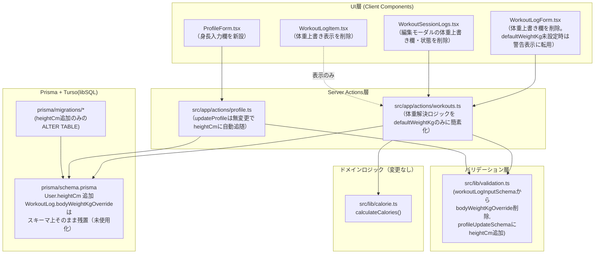
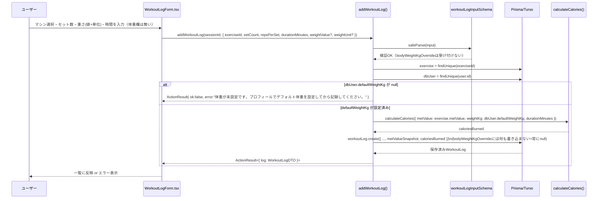
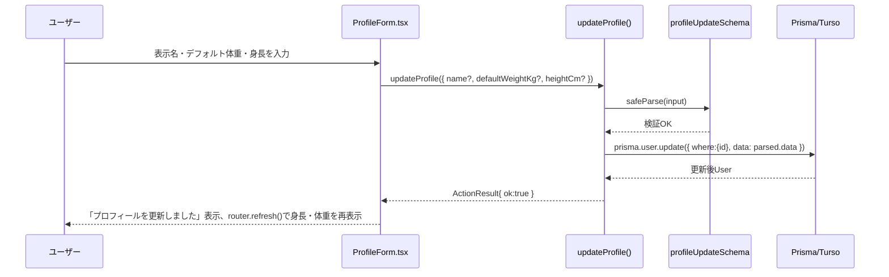

# 基本設計書: プロフィール体重・身長管理への一元化（MuscleBoost）

## 0. 参照
- `requirements.md`（本プロジェクト）
- 情報収集レポート: `C:\project\MuscleBoost\.project\research\topics\2026-09-14-1651-profile-weight-height.md`
- 前プロジェクトの基本設計（マイグレーション運用方針の一次情報源）: `.project/design/2026-09-14-1040-machine-weight-input/basic-design.md` §7
- 前プロジェクトのマイグレーションSQL実例: `prisma/migrations/20260914020356_merge_exercise_intensity_and_workout_weight/migration.sql`

---

## 1. 全体アーキテクチャ

既存アーキテクチャ（Next.js App Router + Server Actions + Prisma + Turso libSQL）は変更しない。影響は「体重の入力経路をプロフィール1箇所に一元化する」「身長という新しい表示専用属性をプロフィールに追加する」の2点に閉じる。



- カロリー計算ドメイン（`calorie.ts`）は無変更。呼び出し側（`workouts.ts`）が渡す `weightKg` の由来が「`bodyWeightKgOverride ?? defaultWeightKg`」から「`defaultWeightKg` のみ」に単純化されるだけで、`calculateCalories()` のシグネチャ・ロジックには影響しない。
- 身長（`heightCm`）はカロリー計算のデータフローに一切登場しない。`ProfileForm.tsx → updateProfile() → prisma.user.update` という保存経路と、`ProfilePage → ProfileForm` という表示経路のみを通る、完全に独立した属性として設計する。

---

## 2. 設計方針として確定する事項

### 2.1 `bodyWeightKgOverride` 列の扱い（確定: A1採用）

情報収集レポートの比較表（A1〜A3）のうち、**A1「列はNullableのまま残し、アプリケーションコード側からは一切参照・書き込みしない（実質廃止）」を採用する。**

**理由:**
1. **最優先の判断基準（マイグレーション要否）**: 本プロジェクトは開発DBと本番DBが同一のTursoインスタンスという制約下にあり（§5で詳述）、破壊的DDL（列削除）を伴うマイグレーションは「本番データの事前確認」「テーブル再構築SQLの静的検証のみで実行結果を試せない」という高リスク作業を必然的に伴う。ユーザー要件「完全に廃止」は文面上「記録画面での体重上書き入力機能」の廃止を指しており、DB列の物理削除までは明示要求されていない。したがって、**アプリケーションの振る舞いとして要件を100%満たしつつ、マイグレーションという不要なリスクを増やさない選択肢（A1）を取ることが、前プロジェクトの教訓（本番マイグレーションの困難さ）を踏まえた最も妥当な判断である。**
2. 既存WorkoutLogデータに `bodyWeightKgOverride` の値が入っている行が本番に存在する可能性が高い（前プロジェクトのE2Eテストがこの列に値を入れて動作確認しているため）。物理削除（A2/A3）を選ぶと、これらの値が完全に失われる。列に残っている値自体はもはやどこからも参照されない「死んだデータ」になるが、それは実害のない状態であり、あえてデータ損失を伴う手段を取る必要がない。
3. A1はDDL変更ゼロのため、そもそも「開発=本番同一DBでどう検証するか」という前プロジェクトで発生した最大の技術的困難（`prisma.config.ts`を一時的にローカルSQLite向けに書き換えて検証するプロセス）が本件に関しては**丸ごと不要になる**。
4. スキーマの可読性低下という唯一のデメリットは、`schema.prisma` 上のコメントで明示することで軽減する（§4のスキーマ変更内容を参照）。

**却下した代替案:**
- A2（`ALTER TABLE DROP COLUMN`によるネイティブ削除）: libSQLでのサポート状況が未検証であり、対応していたとしても開発=本番同一DB制約下でのDDL検証手順（前プロジェクト同様の一時的アダプタ切り替え）が必要になり、コストに見合わない。
- A3（Prisma標準のテーブル再構築パターンによる削除）: `Exercise`テーブル削除時と同等の手間（SQL量最大）がかかり、A1に対して得られるメリット（スキーマの見た目のクリーンさ）が労力に見合わない。

### 2.2 身長カラムの追加方式（確定: `User.heightCm Float?` の単純追加）

情報収集レポートの判断（B1）をそのまま採用する。`User.defaultWeightKg` と全く同じパターン（単一の現在値、Nullable、計算根拠として使われない）であり、`WeightLog` のような時系列履歴テーブルを新設する要求は要件に含まれない。

- **なぜ履歴化しないか（将来の手戻り防止のための明記）**: 要件文言「保存・表示のみ行う（計算には一切使用しない）」が示す通り、身長は「現在のプロフィール属性」であり、体重のように日々変動を追跡・グラフ化する対象ではない（体重は既に`WeightLog`で履歴管理されているが、これは`defaultWeightKg`とは独立した別機能であり、身長にも同様の履歴機能を求める要求は無い）。将来「身長の推移を記録したい」という要件が出た場合は、その時点で`WeightLog`と同様の設計判断を別プロジェクトとして行う。

### 2.3 マイグレーション要否の総合判断（最優先で検討した結果）

| 変更内容 | マイグレーション要否 | 理由 |
|---|---|---|
| `bodyWeightKgOverride` 廃止 | **不要**（DDL変更ゼロ） | §2.1のA1採用により、DB列に触れない。アプリケーションコードの変更のみで完結する。 |
| `heightCm` 追加 | **必要**（`ALTER TABLE "User" ADD COLUMN "heightCm" REAL;` のみ） | 新しいカラムを保存するには列自体が必要。ただし追加のみの単純なDDLであり、既存データへの影響はゼロ、テーブル再構築も不要。 |

結論: **本プロジェクトで必要なマイグレーションは「`heightCm` 列を追加する」という単純な `ADD COLUMN` 1本のみ**であり、削除・再構築系の複雑なDDLは一切発生しない。これは前プロジェクトの`intensityCategory`削除（テーブル再構築が必要だった）より大幅にリスクが低い。マイグレーション適用手順・検証方針は§5で確定する。

### 2.4 プロフィール体重未設定時のエラー文言・エラー発生箇所

**現状（情報収集レポートより）**:
- `addWorkoutLog`: `"体重を入力してください（プロフィールでデフォルト体重を設定するか、この記録で体重を入力してください）"`
- `updateWorkoutLog`: `"体重を入力してください"`（文言が異なり、既存の不整合）

**変更後（確定）**: 体重上書きの選択肢が無くなるため、「この記録で体重を入力してください」という案内は意味を持たなくなる。両関数のエラーメッセージを次の文言に**統一**する。

```
体重が未設定です。プロフィールでデフォルト体重を設定してから記録してください。
```

- **エラー発生箇所**: `addWorkoutLog`・`updateWorkoutLog` の両方で、`dbUser.defaultWeightKg` を取得した直後、カロリー計算（`calculateCalories`呼び出し）より前に判定する（既存と同じ位置）。バリデーション（Zod）エラーとは別枠の、ビジネスルールエラーとして `ActionResult` の `error` フィールドで返す（既存の実装パターンを踏襲、`fieldErrors` は使わない）。
- 両関数のロジック重複を解消するため、体重解決を共通の小関数に切り出す（詳細設計で `resolveDefaultWeightKgOrError()` として定義）。

### 2.5 既存の過去記録への影響（無影響であることの確定）

- `WorkoutLog.caloriesBurned` と `metValueSnapshot` は記録保存時点でスナップショットとしてDBに書き込まれた値であり、以後は再計算されずそのまま読み出されるだけの列である（`getWorkoutSession`・`listWorkoutSessions` のいずれも、これらの列を都度計算せずそのまま返している。既存コード `src/app/actions/workouts.ts` L229-247で確認済み）。
- 本プロジェクトの変更は「新規保存・更新時にどの体重を使ってカロリーを計算するか」というロジックにのみ影響し、`caloriesBurned`/`metValueSnapshot` 列自体へのUPDATE処理は一切追加しない。
- `bodyWeightKgOverride` 列を物理的に触らない（§2.1のA1採用）ため、過去に上書き体重を使って計算・保存された行も、その列の値ごとDBにそのまま残る。表示側（`WorkoutLogItem.tsx`）から当該列を参照するコードを削除するが、これは「上書き体重の値をUIに表示しなくなる」だけであり、**その行の消費カロリー表示（`caloriesBurned`）自体は一切変わらない**。
- 結論: 受け入れ条件6（過去記録の表示不変性）は、本設計の変更内容が「新規計算ロジック」と「UI表示項目の削除」に限定され、スナップショット列へのUPDATE・DB列削除を一切含まないことによって自動的に満たされる。

---

## 3. データフロー（記録作成シーケンス、変更後）



プロフィール更新のデータフロー（身長追加後）:



---

## 4. モジュール分割 / I/F定義

| モジュール | 責務 | 変更内容 |
|---|---|---|
| `prisma/schema.prisma` | データモデル定義 | `User.heightCm Float?` 追加。`WorkoutLog.bodyWeightKgOverride` はスキーマ上変更しない（未使用である旨のコメントのみ追記）。 |
| `prisma/migrations/<timestamp>_add_user_height_cm/migration.sql` | スキーマ移行 | `ALTER TABLE "User" ADD COLUMN "heightCm" REAL;` のみの新規マイグレーションファイル。 |
| `src/types/index.ts` | 型定義・DTO | `WorkoutLogDTO.bodyWeightKgOverride` を削除。`UserProfileDTO`（新設 or 既存の直接prisma型利用箇所に`heightCm`を反映）。 |
| `src/lib/validation.ts` | 入力検証 | `workoutLogInputSchema` から `bodyWeightKgOverride` を削除。`profileUpdateSchema` に `heightCm` を追加。 |
| `src/lib/calorie.ts` | カロリー計算 | **変更なし**。 |
| `src/app/actions/workouts.ts` | 記録CRUD・カロリー計算 | `addWorkoutLog`/`updateWorkoutLog` の体重解決ロジックを共通化し `defaultWeightKg` のみを見るよう簡素化。DTOマッピングから `bodyWeightKgOverride` を除去。エラー文言を統一。 |
| `src/app/actions/profile.ts` | プロフィール更新 | コード変更なし（`profileUpdateSchema`の変更に自動追随する設計のため）。 |
| `src/components/WorkoutLogForm.tsx` | 記録作成UI | 体重上書き入力欄を削除。`defaultWeightKg` propが `null` の場合、警告メッセージ＋プロフィールへのリンクを表示するよう用途を転用。 |
| `src/components/WorkoutSessionLogs.tsx` | 記録編集UI | 編集モーダルの体重上書き入力欄・状態（`editBodyWeightKgOverride`）を削除。 |
| `src/components/WorkoutLogItem.tsx` | 記録表示UI | `bodyWeightKgOverride` を使った条件表示を削除。 |
| `src/components/ProfileForm.tsx` | プロフィール編集UI | 身長入力欄を新設。 |
| `src/app/profile/page.tsx` | プロフィール画面 | `ProfileForm` へ `initialHeightCm` を渡す。 |
| `tests/unit/calorie.test.ts` | 単体テスト | 変更不要（`bodyWeightKgOverride`にもfallbackロジックにも依存していないことを確認済み）。 |
| `tests/e2e/workout-flow.spec.ts` | E2Eテスト | 体重上書きに依存する4シナリオを新しい挙動に合わせて書き換え。 |

---

## 5. マイグレーション方針（確定）

### 5.1 運用方針（前プロジェクトを踏襲）

- `prisma.config.ts` の `adapter` は常にTurso（`TURSO_DATABASE_URL`/`TURSO_AUTH_TOKEN`）を向いており、開発DBと本番DBが同一インスタンスのため、ローカルで無防備に `prisma migrate dev`/`deploy` を実行すると本番へ直接影響する。
- 本プロジェクトでも前プロジェクト（`2026-09-14-1040-machine-weight-input`）と**同じ運用**を踏襲する:
  1. マイグレーションSQLはPrisma CLIで機械的に生成せず、変更内容が単純（`ADD COLUMN`のみ）であるため手動でSQLファイルを作成する。
  2. ローカル検証は、`prisma.config.ts` を一時的にローカルSQLite（`prisma/dev.db`、または新規の使い捨てファイル）向けに書き換え、生成したSQLをNode.jsスクリプト等から直接適用して動作確認する。検証後は `prisma.config.ts` を必ず元の状態（Turso向け）に戻す。
  3. 本番Tursoへの実適用は、コードのpush後、GitHub Actions経由の `npx prisma migrate deploy`（`.github/workflows/deploy.yml`、既に前プロジェクトで追加済み・現時点で作業ツリーに存在するが未コミット）に委ねる。本プロジェクトの実装フェーズでは**ローカルからTursoへ直接マイグレーションを適用しない**。
  4. 本番反映（実際のpush・デプロイ実行）は、このプロジェクトの実装・QAが完了した後、ユーザー確認のもとで実施する別作業とする（前プロジェクトの申し送りと同じ方針）。

### 5.2 マイグレーションSQL（確定内容）

新規マイグレーションディレクトリ: `prisma/migrations/<YYYYMMDDHHMMSS>_add_user_height_cm/migration.sql`
（タイムスタンプは実装時のファイル作成時刻を用いる。既存の最新マイグレーション `20260914020356_merge_exercise_intensity_and_workout_weight` より新しい時刻にする。）

```sql
-- AlterTable
ALTER TABLE "User" ADD COLUMN "heightCm" REAL;
```

- `bodyWeightKgOverride` に関するDDLは一切含めない（§2.1・§2.3の結論通り）。
- 列削除・テーブル再構築を伴わないため、前プロジェクトの `Exercise` 再構築SQL（`PRAGMA defer_foreign_keys` 等を伴う複雑な手順）は不要。既存の `weightValue`/`weightUnit` 追加時（同マイグレーションファイル内 L85-86）と全く同じ、単純な `ALTER TABLE ... ADD COLUMN` パターンのみで完結する。

### 5.3 未コミット変更との関係（申し送り事項）

- `git status` の時点で、前2プロジェクト分（`machine-weight-input`, `training-volume`）のコード変更・マイグレーションがまだコミットされていない。本プロジェクトのマイグレーションはこれらの上に積み重なる形になる。
- `.github/workflows/deploy.yml` は既に `npx prisma migrate deploy` ステップを含む内容に変更済み（現在の作業ツリーの内容を確認済み。git diffでは `M` 扱いのため、コミットはまだされていない）。本プロジェクトはこのファイルに追加の変更を加える必要はない。
- コミット・pushの順序（前2プロジェクト分＋本プロジェクトをまとめて1回のpushにするか、分割するか）はPM/ユーザー確認事項とし、本設計書のスコープ外とする。実装フェーズはコード変更のみを行い、pushの実行そのものはユーザー確認後の別作業とする。

---

## 6. 非対象・トレードオフ整理

| 項目 | 扱い |
|---|---|
| `bodyWeightKgOverride`列の物理削除 | 実施しない（§2.1、A1採用）。DB上には「使われない列」として残るが、`schema.prisma`にコメントで明記することで可読性低下を軽減する。 |
| 身長の履歴管理（`WeightLog`相当のテーブル新設） | 実施しない（§2.2、要件に履歴化の言及なし）。将来要件が出た場合は別プロジェクトで検討する。 |
| 身長を使ったBMI等の計算機能 | 実施しない（要件で明示的にスコープ外）。 |
| `addWorkoutLog`/`updateWorkoutLog`のエラー文言統一 | 実施する（§2.4）。要件外の副次的改善だが、上書き機能廃止に伴い自然に発生する変更であるため本プロジェクトに含める。 |
| 本番Tursoへの実マイグレーション適用・デプロイ実行 | 本プロジェクトでは実施しない。コード・マイグレーションファイルの用意までとし、適用はユーザー確認後の別作業とする（§5.1）。 |
