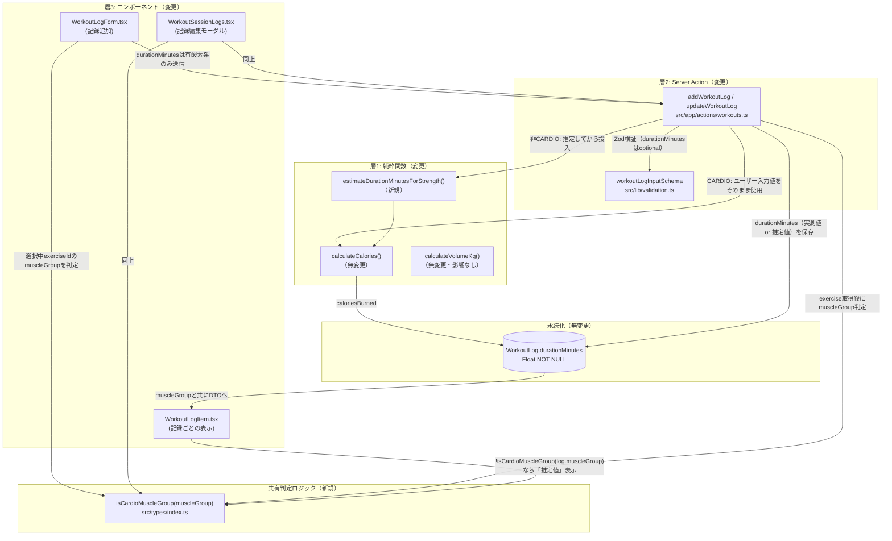

# 基本設計書: 運動時間の任意化（有酸素系は必須維持・筋トレ系は固定想定値で算出）

## 1. 全体アーキテクチャ

既存のカロリー計算・バリデーションの3層パターン（純粋関数 → Server Action → コンポーネント）を維持したまま、判定ロジック（有酸素/筋トレ）を各層に横断的に追加する。



## 2. モジュール分割

| モジュール | 種別 | 責務 |
|---|---|---|
| `src/types/index.ts` | 変更 | `isCardioMuscleGroup(muscleGroup)`（有酸素/筋トレ判定の唯一の実装）を追加。`WorkoutLogDTO`に`muscleGroup`を追加。UI・Server Actionの両方から`import`して同一ロジックを共有する（判定ロジックの二重実装を防ぐ）。 |
| `src/lib/calorie.ts` | 変更 | `estimateDurationMinutesForStrength(setCount, repsPerSet)`と、その根拠となる想定値定数2つを追加。既存の`calculateCalories`/`CALORIE_CORRECTION_FACTOR`は無変更。 |
| `src/lib/validation.ts` | 変更 | `workoutLogInputSchema.durationMinutes`を`optional()`化。範囲検証（`positive().max(600)`）は値が存在する場合のみ適用される（Zodの`optional()`は「フィールド自体の省略」を許可するだけで、値がある場合の制約は维持される）。 |
| `src/app/actions/workouts.ts` | 変更 | `addWorkoutLog`/`updateWorkoutLog`で、Zod検証後に取得した`exercise.muscleGroup`を使って「CARDIO必須チェック」と「非CARDIOの推定値算出」を行う。`getWorkoutSession`で`muscleGroup`をDTOに含める。 |
| `src/components/WorkoutLogForm.tsx` | 変更 | 選択中種目の`muscleGroup`により運動時間欄の表示/非表示を切り替える。非表示時は`durationMinutes: undefined`を送信する。 |
| `src/components/WorkoutSessionLogs.tsx` | 変更 | 編集モーダルで同様の表示切替を行う（`WorkoutLogForm.tsx`とは別実装のまま、既存の重複パターンを踏襲）。 |
| `src/components/WorkoutLogItem.tsx` | 変更 | `log.muscleGroup`から`isCardioMuscleGroup()`を用いて、非CARDIOの記録に「（推定値）」ラベルを表示する。 |
| `src/lib/volume.ts` | **無変更** | `setCount`/`repsPerSet`/`weightValue`/`weightUnit`のみに依存し`durationMinutes`を一切使わないため、本改修の影響を受けない。 |
| `prisma/schema.prisma`, `prisma/seed.ts` | **無変更** | マイグレーション不要（4章参照）。判定・区別ロジックはすべてアプリケーション層で完結する。 |

## 3. データフロー

### 3.1 記録追加（`addWorkoutLog`）／編集（`updateWorkoutLog`）

```
[クライアント入力]
  exerciseId, setCount, repsPerSet, durationMinutes?(有酸素系のみ入力欄あり), weightValue?, weightUnit?
        │
        ▼
workoutLogInputSchema.safeParse(input)
  ※ durationMinutesが未定義でもZod検証は通る（optional化）
        │ 失敗 → { ok:false, fieldErrors } を返して終了
        ▼
exercise = prisma.exercise.findUnique({ id: exerciseId })
  ※ 存在しない場合はエラーで終了（既存ロジックのまま）
        │
        ▼
isCardioMuscleGroup(exercise.muscleGroup)?
        │
   ┌────┴─────┐
  Yes(有酸素系)         No(筋トレ系)
   │                     │
   ▼                     ▼
durationMinutes         durationMinutes
undefined?              = estimateDurationMinutesForStrength(
   │Yes → fieldErrors      setCount, repsPerSet)
   │   {durationMinutes:  ※ クライアントが何を送ってきても無視し、
   │   ["有酸素系の..."]}   常にサーバー側で再計算する
   │No↓
durationMinutes = data.durationMinutes（ユーザー入力値をそのまま使用）
        │
        ▼（以降は有酸素/筋トレ共通）
calculateCalories({ metValue: exercise.metValue, weightKg, durationMinutes })
        │
        ▼
prisma.workoutLog.create/update({ ..., durationMinutes, caloriesBurned, ... })
  ※ durationMinutes列には「実測値」も「推定値」も区別なく同じ列に保存する
        │
        ▼
WorkoutLogDTO { ..., durationMinutes, muscleGroup: exercise.muscleGroup, caloriesBurned, volumeKg }
  としてクライアントへ返却
```

### 3.2 セッション詳細取得（`getWorkoutSession`）

```
prisma.workoutSession.findUnique({ include: { logs: { include: { exercise: true } } } })
        │
        ▼ (map内で1件ずつ)
WorkoutLogDTO {
  ...,
  durationMinutes: l.durationMinutes,       // 保存済みの値（実測 or 推定、区別なく格納済み）
  muscleGroup: l.exercise.muscleGroup,      // 表示側で実測/推定を判別するための材料
}
```

### 3.3 UI側の表示切替（`WorkoutLogForm.tsx` / `WorkoutSessionLogs.tsx`）

```
selectedExercise = exercises.find(ex => ex.id === exerciseId)
requiresDuration = selectedExercise ? isCardioMuscleGroup(selectedExercise.muscleGroup) : false
  （種目未選択時は運動時間欄を表示しない）

requiresDuration === true  → 運動時間欄を表示し、必須マーク（*）を出す
requiresDuration === false → 運動時間欄を表示しない

送信時:
  durationMinutes: (requiresDuration && durationMinutes !== "") ? Number(durationMinutes) : undefined
```

### 3.4 記録表示側の推定値ラベル（`WorkoutLogItem.tsx`）

```
isEstimatedDuration = !isCardioMuscleGroup(log.muscleGroup)
表示: "{setCount}セット × {repsPerSet}レップ / {durationMinutes}分" + (isEstimatedDuration ? "（推定値）" : "")
```

## 4. 外部インターフェース（I/F）変更点

| I/F | 変更内容 |
|---|---|
| `workoutLogInputSchema`（Zod） | `durationMinutes`が`optional()`になる。それ以外のフィールド・`superRefine`（重さペア検証）は無変更。 |
| `addWorkoutLog(sessionId, input)` | 引数シグネチャは無変更（`input: unknown`のまま）。戻り値`ActionResult<{ log: WorkoutLogDTO }>`の`WorkoutLogDTO`に`muscleGroup`が追加される。CARDIOかつ`durationMinutes`未指定の場合、新たに`fieldErrors.durationMinutes`を返すケースが追加される。 |
| `updateWorkoutLog(logId, input)` | 同上。 |
| `getWorkoutSession(id)` | 戻り値`WorkoutSessionDetailDTO.logs[].muscleGroup`が追加される。 |
| `WorkoutLogDTO`（型） | `muscleGroup: MuscleGroup`を追加（既存フィールドは無変更）。 |
| `estimateDurationMinutesForStrength(setCount, repsPerSet)`（新規, `src/lib/calorie.ts`） | 純粋関数。`number, number -> number`。 |
| `isCardioMuscleGroup(muscleGroup)`（新規, `src/types/index.ts`） | 純粋関数。`MuscleGroup -> boolean`。 |
| `calculateCalories()` | **無変更**（シグネチャ・実装とも既存のまま）。 |
| `calculateVolumeKg()` | **無変更**。 |

## 5. 設計判断の詳細（トレードオフの明記）

### 5.1 DBに「実測値/推定値」区別フラグを追加するか → **追加しない**
- **採用**: DBスキーマは無変更。`WorkoutLogDTO.muscleGroup`（＝`exercise.muscleGroup`をServer Action内で都度参照）から`isCardioMuscleGroup()`により導出する。
- **理由**:
  1. `Exercise.muscleGroup`は作成後に編集する手段が存在しない（`src/app/actions/exercises.ts`に`updateExercise`相当のactionはなく、`createExercise`/`deleteCustomExercise`/`listExercises`のみ）。したがって、ある`WorkoutLog`が参照する`exercise`の`muscleGroup`は記録後に変化しない。都度導出しても値がぶれるリスクはない。
  2. 本プロジェクト以降、非CARDIO種目の`durationMinutes`は常にサーバー推定値、CARDIO種目は常にユーザー入力値という1対1対応が業務ルールとして確定するため、フラグ列を別途持つことは実質的に`exercise.muscleGroup`の複製（冗長な状態）になる。
  3. 既存コードベースは、Turso本番/開発DB共有環境でのマイグレーション実行に伴うDDLリスクを理由に、過去複数回（`bodyWeightKgOverride`, `secondsPerSetOverride`）「使わなくなった列でも消さずに残す/新しい列を増やさない」判断を取ってきた実績がある。この方針との一貫性を優先する。
- **許容するトレードオフ**: 本改修より前に保存された既存の筋トレ系記録（＝当時は必須入力だったため実際にユーザーが入力した値）も、本改修後の表示ロジック上は「推定値」ラベルが付く。これは「その`durationMinutes`が現在の業務ルール（非CARDIOは常に推定）の下でどう扱われる値か」を示すラベルであり、過去の入力実態を否定するものではないため許容する。将来「過去の実測値だけは区別したい」という要件が生じた場合は、別途タイムスタンプ基準（本機能のリリース日時以前/以降）や新規フラグ列の追加を再検討する。

### 5.2 バリデーションをZod単体で完結させるか → **Server Action内の追加チェックとする（候補A）**
- **不採用の代替案**: `workoutLogInputSchema`に`muscleGroup`を入力として持たせ`superRefine`のみで完結させる案は、クライアント申告の`muscleGroup`とDBの`exercise.muscleGroup`が二重管理になり、クライアントが不正な`muscleGroup`を送信した場合に必須チェックを迂回できてしまう（信頼境界の観点で不適切）。
- **採用理由**: 既存コードは`addWorkoutLog`/`updateWorkoutLog`とも「Zod検証 → `exercise`をDBから取得」という順序が既に確立しており、`exercise`取得後に検証を追加することは既存の構造に自然に合致する。

### 5.3 運動時間欄の表示方式 → **非表示方式を採用（グレーアウト表示は不採用）**
- 依頼文の「運動時間の入力を不要にし」という表現、および「固定の想定値を用いて計算する」という業務ルールから、非CARDIO種目については運動時間という概念自体をユーザーに意識させない設計が適切と判断する。
- グレーアウト＋任意ラベル案は、ユーザーに「入力しても良い値」という誤解を与え、かつ「入力しても実際にはサーバー側で無視される」という仕様（5.2節のSR-3参照）と表示上の期待が食い違うため不採用とする。

## 6. 影響を与えないことの明示
- `src/lib/volume.ts`（`calculateVolumeKg`）: 完全に無変更。`setCount`/`repsPerSet`/`weightValue`/`weightUnit`のみに依存し`durationMinutes`を参照しないため、本プロジェクトのいかなる変更の影響も受けない。
- `src/lib/calorie.ts`の既存export（`CALORIE_CORRECTION_FACTOR`, `CalorieCalcInput`, `calculateCalories`）: シグネチャ・実装とも無変更（新規exportの追加のみ）。
- `prisma/schema.prisma` / `prisma/migrations/`: 無変更。マイグレーションファイルは生成されない。
- `prisma/seed.ts`, `src/components/ExercisePicker.tsx`: 無変更。
- `secondsPerSetOverride`（廃止済み未使用列）: 一切参照・変更しない。
