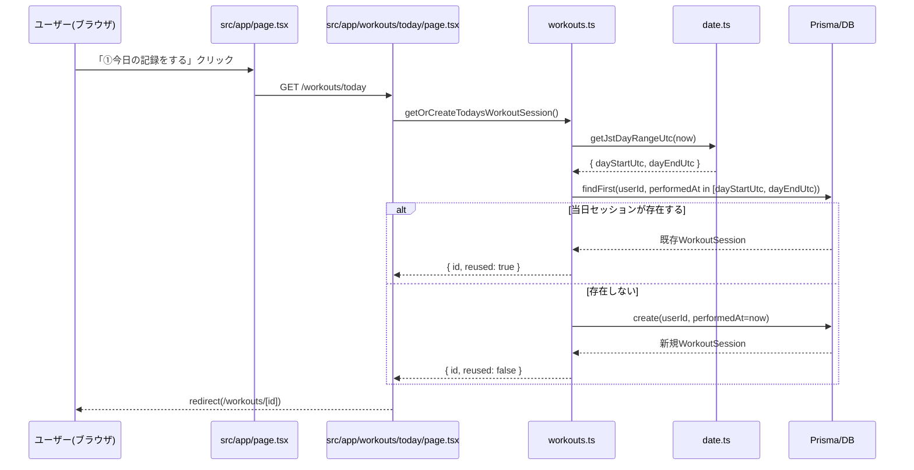
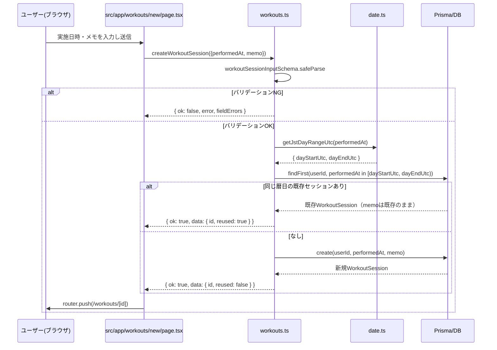
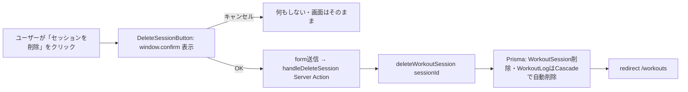

# 基本設計書: ワークアウトセッションの「同じ日は同一セッション」継続化

前提: `requirements.md`（本プロジェクト内）を満たす設計。既存アーキテクチャ（Next.js App Router / Server Actions / Prisma / SQLite・本番はTurso libSQL）は変更しない。スキーマ変更なしで実現する。

## 1. 全体アーキテクチャ（該当範囲）

```
[ブラウザ]
   │
   ├─ ① ホーム「①今日の記録をする」 GET /workouts/today (★新規)
   │        │
   │        ▼
   │   [src/app/workouts/today/page.tsx] (★新規, Server Component, UIなし)
   │        │  await getOrCreateTodaysWorkoutSession()
   │        ▼
   │   [src/app/actions/workouts.ts]
   │        └─▶ resolveOrCreateSessionForDay(userId, now, undefined) (★新規, 非公開ヘルパー)
   │                 └─▶ getJstDayRangeUtc(now)  … src/lib/date.ts (★変更)
   │                 └─▶ prisma.workoutSession.findFirst(当日範囲)
   │                        ├─ 見つかった → 既存セッションを返す (reused: true)
   │                        └─ 見つからない → prisma.workoutSession.create() (reused: false)
   │        │
   │        ▼
   │   redirect(`/workouts/${id}`)
   │
   └─ ② /workouts一覧「新規セッション」 or 直接 /workouts/new へアクセス GET /workouts/new
            │
            ▼
       [src/app/workouts/new/page.tsx] (変更: 説明文追加のみ)
            │  ユーザーが実施日時・メモを入力して送信
            ▼
       createWorkoutSession(input)  … src/app/actions/workouts.ts (変更)
            └─▶ resolveOrCreateSessionForDay(userId, performedAt, memo) ※①と同じ非公開ヘルパーを共有
            │
            ▼
       router.push(`/workouts/${id}`)

いずれの経路も最終的に同じ画面へ合流する:
       [src/app/workouts/[id]/page.tsx] (変更: 削除ボタンに確認ダイアログ追加)
            └─▶ [src/components/DeleteSessionButton.tsx] (★新規, Client Component)
            └─▶ [src/components/WorkoutSessionLogs.tsx] (変更なし。記録追加・編集・削除は既存のまま機能する)
```

- 変更の中心は`resolveOrCreateSessionForDay`という**単一の非公開ヘルパー関数**であり、①（当日直行）と②（明示的な日時指定フォーム）の両方の入口がこれを共有する。これにより「同じ日は同一セッション」という business rule の実装箇所を1箇所に一元化する（情報収集レポートが指摘した「唯一のエントリーポイント」という既存設計の性質を維持したまま拡張する）。
- `/workouts/[id]`配下（`WorkoutSessionLogs`、記録の追加・編集・削除）は無変更。どの経路でも最終的に既存セッションIDに到達しさえすれば、これまで通り動作する（情報収集レポートの分析通り）。

## 2. アーキテクチャ判断: 採用方式

| 判断項目 | 内容 |
|---|---|
| 採用方式 | 候補A（find-or-create）＋候補B（当日セッションへの直行導線）の組み合わせ。`createWorkoutSession`内部にfind-or-createを実装し、かつホーム画面の主導線を`/workouts/today`という新しい「直行専用ページ」に切り替える |
| 不採用: 候補C（`WorkoutSession`にステータス/`closedAt`を追加） | スキーマ変更・マイグレーションを要し、「明示的にセッションを終了する」UIの新設も必要になる。依頼は「同じ日は同一セッションにしたい」というシンプルな要望であり、要件定義で「セッションを明示的に終了するUIは現状存在せず、今回もスコープに含めない」と確定させたため、オーバースペックと判断し不採用（将来、1日複数セッションを許容したくなった場合の拡張候補として設計書に記録するに留める） |
| 不採用: 候補D（クライアント側localStorageに現在セッションIDを保持） | マルチデバイス・別ブラウザで機能しない。「同じ日」はサーバー側の日付判定であるべきで、既存設計の「サーバー側所有権チェック重視」の方針（QAレポートのマルチユーザー分離テスト等）と整合しない |
| 「同じ日」の判定基準フィールド | `performedAt`を採用（`createdAt`は不採用）。理由: `performedAt`は「いつジムに行ったか」を表す既存のドメインフィールドであり、`/workouts/new`でユーザーが過去日付を指定するケース（バックフィル）にも同じ結合ルールを一貫して適用できる。`createdAt`を基準にすると、「今日作ったレコードだが過去の日付を指定した」場合に矛盾する判定になる |
| タイムゾーン | JST（Asia/Tokyo, UTC+9固定、サマータイムなし）を採用。サーバー実行環境のローカルタイムゾーンに依存させないため、`Intl`のタイムゾーンDBや`TZ`環境変数を使わず、固定オフセットのミリ秒演算で暦日境界を算出する（JSTはサマータイムが存在しないため、固定オフセットで将来にわたり正確） |

## 3. モジュール分割・変更範囲

| モジュール | 種別 | 変更内容概要 |
|---|---|---|
| `src/lib/date.ts` | 変更 | JST暦日の範囲を返す`getJstDayRangeUtc`を追加 |
| `src/app/actions/workouts.ts` | 変更 | `createWorkoutSession`をfind-or-create化。非公開ヘルパー`resolveOrCreateSessionForDay`を追加。新規Server Action`getOrCreateTodaysWorkoutSession`を追加 |
| `src/app/workouts/today/page.tsx` | 新規 | 当日セッションへの直行専用ページ（UIなし、find-or-create→redirect） |
| `src/app/page.tsx` | 変更 | 「①今日の記録をする」の`href`を`/workouts/new`→`/workouts/today`に変更 |
| `src/app/workouts/new/page.tsx` | 変更 | 合流時の挙動（メモ非反映）を説明する注記文を追加 |
| `src/components/DeleteSessionButton.tsx` | 新規 | 削除確認ダイアログ付きボタン（Client Component） |
| `src/app/workouts/[id]/page.tsx` | 変更 | 既存の削除ボタンを`DeleteSessionButton`に置き換え |
| `tests/unit/date.test.ts` | 新規 | `getJstDayRangeUtc`の境界値単体テスト |
| `tests/e2e/workout-flow.spec.ts` | 要検証（詳細設計書で判定） | find-or-create化後も既存テストが成立するかの回帰確認。必要なら合流挙動を検証する新規テストケースを追加 |

スキーマ（`prisma/schema.prisma`）、既存の集計ロジック（`listWorkoutSessions`/`getWorkoutSession`/`getDashboardStats`）、`WorkoutSessionLogs.tsx`、`WorkoutLogForm`等のログ入力コンポーネント、認証まわり（`middleware.ts`/`auth.config.ts`）は変更対象外。

## 4. データフロー

### 4.1 当日直行フロー（新規導線、ホーム画面経由）



### 4.2 明示的フォーム経由フロー（`/workouts/new`、過去日付バックフィルを含む）



### 4.3 セッション削除フロー（確認ダイアログ追加）



## 5. I/F 定義

### 5.1 `src/lib/date.ts`（変更・追加分のみ）

```ts
/** JSTは UTC+9 固定でサマータイムが無いため、固定オフセットで安全に扱える。 */
export const JST_OFFSET_MS: number;

/**
 * 指定したUTC日時が属するJST暦日の開始・終了（ともにUTCのDateとして返す）を返す。
 * 戻り値は半開区間 [dayStartUtc, dayEndUtc) として扱うこと（dayEndUtcは翌日のJST 0:00に対応するUTC時刻）。
 */
export function getJstDayRangeUtc(date: Date): { dayStartUtc: Date; dayEndUtc: Date };
```

既存の`getPeriodRange(days: number)`は変更しない（ダッシュボードの「直近N日」集計は暦日境界ではなくローリング24時間窓のままでよいと要件定義で確認済み）。

### 5.2 `src/app/actions/workouts.ts`（変更・追加分のみ）

```ts
/** 非公開ヘルパー。find-or-createの本体。createWorkoutSessionとgetOrCreateTodaysWorkoutSessionが共有する。 */
async function resolveOrCreateSessionForDay(
  userId: string,
  performedAt: Date,
  memo: string | undefined
): Promise<{ id: string; reused: boolean }>;

/** 既存Server Action。戻り値のdataにreusedを追加（後方互換）。 */
export async function createWorkoutSession(
  input: unknown
): Promise<ActionResult<{ id: string; reused: boolean }>>;

/** 新規Server Action。引数なしで「今日」を基準にfind-or-createする。 */
export async function getOrCreateTodaysWorkoutSession(): Promise<
  ActionResult<{ id: string; reused: boolean }>
>;
```

### 5.3 `src/app/workouts/today/page.tsx`（新規）

```ts
export default async function TodayWorkoutSessionRedirectPage(): Promise<never>;
```
- 画面を描画しない（`redirect()`が必ず投げられるため`never`を返す設計）。UIを持たない中継ページ。

### 5.4 `src/components/DeleteSessionButton.tsx`（新規）

```ts
interface DeleteSessionButtonProps {
  confirmMessage: string;
}
export default function DeleteSessionButton(props: DeleteSessionButtonProps): JSX.Element;
```
- 既存の`<form action={handleDeleteSession}>`の内側で使う`type="submit"`ボタン。`onClick`で`window.confirm(confirmMessage)`が`false`の場合は`preventDefault()`してフォーム送信を止める。

### 5.5 外部I/Fへの影響

- 外部API・DBスキーマへの変更はない。既存の`WorkoutSession`/`WorkoutLog`テーブル、既存の`@@index([userId, performedAt])`をそのまま利用する。

## 6. 影響を受けないもの（明示）

- `prisma/schema.prisma`: 変更なし。
- `middleware.ts` / `src/lib/auth.ts` / `src/lib/auth.config.ts`: 変更なし。
- `src/app/actions/workouts.ts`の`addWorkoutLog` / `updateWorkoutLog` / `deleteWorkoutLog` / `listWorkoutSessions` / `getWorkoutSession` / `getDashboardStats`: ロジック変更なし（対象`WorkoutSession`の粒度が変わるのみ）。
- `src/components/WorkoutSessionLogs.tsx` / `WorkoutLogForm` / `WorkoutLogItem` / `ExercisePicker`: 変更なし。
- `src/lib/calorie.ts` / `src/lib/volume.ts` / `src/lib/weight.ts`: 変更なし。
