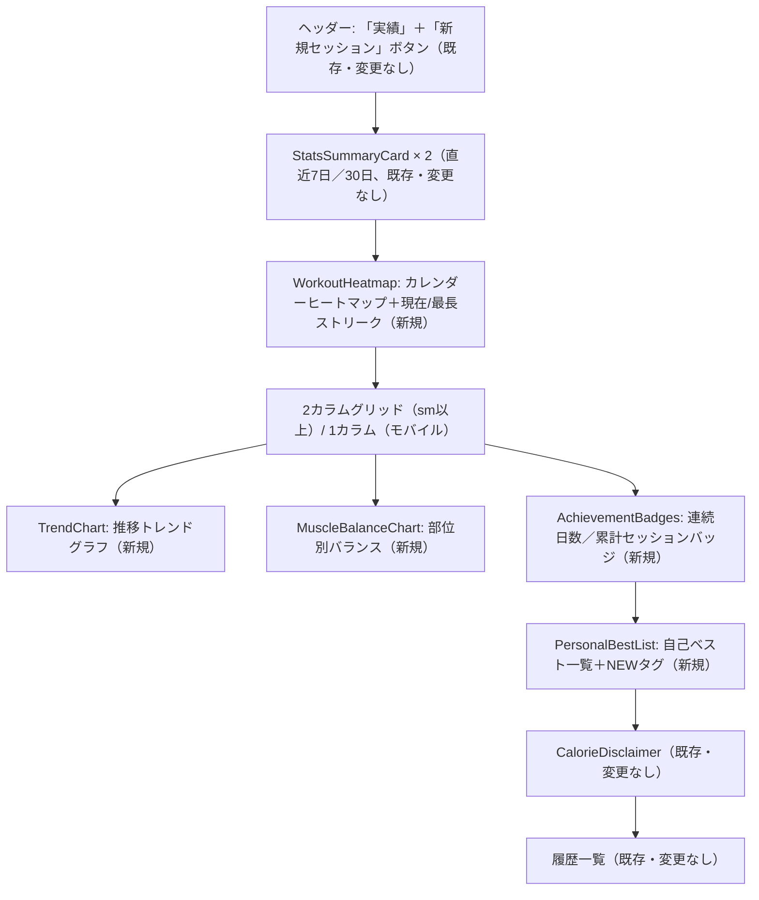

# 基本設計書: 実績画面（/workouts）ビジュアル要素4種追加

前提ドキュメント: `requirements.md`（本プロジェクト内）、情報収集レポート`C:\project\MuscleBoost\.project\research\topics\2026-09-15-1422-achievements-visual-redesign.md`

## 1. 全体アーキテクチャ

既存の「Server Component/Server Action がデータ取得・計算を行い、Client Componentは表示専用」という分離方針（`src/components/StatsSummaryCard.tsx`が参考実装）を踏襲する。今回はさらに、**DBアクセスを含む層（Server Action）**と**DBアクセスを含まない純粋な集計ロジック層**を明確に分離する。これにより、集計ロジックをPrisma/DBなしで単体テストできる（`src/lib/calorie.ts`, `src/lib/volume.ts`と同じ設計思想の踏襲）。

```mermaid
flowchart TB
    subgraph Browser["ブラウザ"]
        UI["/workouts 画面"]
    end

    subgraph ServerComponent["Server Component層"]
        Page["src/app/workouts/page.tsx"]
        Heatmap["WorkoutHeatmap.tsx（表示専用）"]
        PBList["PersonalBestList.tsx（表示専用）"]
        Badges["AchievementBadges.tsx（表示専用）"]
    end

    subgraph ClientComponent["Client Component層（\"use client\"）"]
        Trend["TrendChart.tsx（Recharts AreaChart）"]
        Balance["MuscleBalanceChart.tsx（Recharts PieChart）"]
    end

    subgraph ServerAction["Server Action層（\"use server\"）"]
        GetData["getAchievementsData()<br/>src/app/actions/achievements.ts"]
        ExistingActions["getDashboardStats / listWorkoutSessions<br/>（既存、変更なし）"]
    end

    subgraph PureLogic["純粋集計ロジック層（DB非依存）"]
        Lib["src/lib/achievements.ts<br/>buildWorkoutHeatmap / buildTrendSeries /<br/>buildMuscleGroupBalance / buildPersonalBests /<br/>buildAchievementBadges"]
        DateLib["src/lib/date.ts（拡張）"]
        VolumeLib["src/lib/volume.ts（既存、変更なし）"]
    end

    subgraph DB["データベース（Prisma / SQLite）"]
        WS[("WorkoutSession")]
        WL[("WorkoutLog")]
        EX[("Exercise")]
    end

    UI --> Page
    Page --> Heatmap
    Page --> Trend
    Page --> Balance
    Page --> Badges
    Page --> PBList
    Page --> GetData
    Page --> ExistingActions
    GetData --> Lib
    Lib --> DateLib
    Lib --> VolumeLib
    GetData -- "findMany(1回)" --> WS
    WS --> WL
    WL --> EX
```

## 2. データフロー

1. ユーザーが`/workouts`にアクセスすると、`page.tsx`（Server Component）が`Promise.all`で既存2関数（`getDashboardStats`, `listWorkoutSessions`）と新規`getAchievementsData()`を並行実行する。
2. `getAchievementsData()`は`getCurrentUserOrThrow()`でユーザーを特定した後、対象ユーザーの**全期間**の`WorkoutSession`を`logs`（`exercise`込み）と共に1回だけ`findMany`する。
3. 取得したPrisma行を、DB型に依存しないプレーンな`AchievementSessionInput[]`に詰め替える。
4. `src/lib/achievements.ts`の5つの純粋関数（`buildWorkoutHeatmap`, `buildTrendSeries`, `buildMuscleGroupBalance`, `buildPersonalBests`, `buildAchievementBadges`）に、詰め替えたデータと現在時刻`now`を渡し、それぞれのDTOを得る。
5. 5つのDTOを`AchievementsDataDTO`にまとめて`page.tsx`に返す。
6. `page.tsx`は各DTOを対応する表示コンポーネントにpropsとして渡す。データ取得・集計は一切コンポーネント内では行わない（`StatsSummaryCard`と同じ「渡されたものをそのまま描画する」方針）。
7. `TrendChart`/`MuscleBalanceChart`（Client Component）は、受け取ったDTOに対して**表示切替（週/月、カロリー/ボリューム、頻度/ボリューム）のUI状態のみ**を内部で持ち、再フェッチは行わない（初回に必要なデータを全て併せて渡しているため）。

なぜ「1回のfindMallで全期間取得」なのか: ヒートマップは直近371日、トレンドグラフは直近12週/6ヶ月で済むが、**累計セッション数バッジ・最長ストリーク・自己ベストは全期間のデータが必要**であり、期間を絞ったクエリを複数回発行するより、既存の`listWorkoutSessions`と同様に1回の全件取得で済ませる方がシンプルで一貫性がある（要件定義 NFR-3）。データ量が増えた場合の最適化余地は「9. 将来課題」に記載する。

## 3. モジュール分割

| レイヤ | ファイル | 責務 |
|---|---|---|
| 型定義 | `src/types/index.ts`（変更） | 新規DTO型、`MUSCLE_GROUP_CHART_COLORS`定数 |
| 日付ユーティリティ | `src/lib/date.ts`（変更） | JST暦日キー化・暦週/暦月境界・日数加算の追加関数 |
| 集計純粋関数 | `src/lib/achievements.ts`（新規） | ヒートマップ/トレンド/部位別バランス/自己ベスト/バッジの5系統の集計ロジックとバッジ閾値・ウィンドウ日数などの定数 |
| データ取得 | `src/app/actions/achievements.ts`（新規） | `getAchievementsData()`。Prismaクエリ実行＋純粋関数呼び出しの橋渡しのみ |
| 表示（Server Component） | `src/components/WorkoutHeatmap.tsx`（新規） | カレンダーヒートマップ＋ストリーク表示 |
| 表示（Server Component） | `src/components/PersonalBestList.tsx`（新規） | 自己ベスト一覧＋NEWタグ |
| 表示（Server Component） | `src/components/AchievementBadges.tsx`（新規） | 連続日数/累計セッションバッジ |
| 表示（Client Component） | `src/components/TrendChart.tsx`（新規） | Rechartsによる推移トレンドグラフ＋週/月・カロリー/ボリューム切替 |
| 表示（Client Component） | `src/components/MuscleBalanceChart.tsx`（新規） | Rechartsによる部位別ドーナツチャート＋頻度/ボリューム切替 |
| 画面組み込み | `src/app/workouts/page.tsx`（変更） | 上記コンポーネントの配置・データの受け渡し |

## 4. 外部インターフェース（I/F）定義

### 4.1 Server Action

```ts
// src/app/actions/achievements.ts
export async function getAchievementsData(): Promise<AchievementsDataDTO>;
```
- 引数なし。ログインユーザー自身のデータのみを対象とする（`getCurrentUserOrThrow()`で担保）。
- 失敗系の戻り値は持たない（既存の`listWorkoutSessions`, `getWorkoutSession`, `getDashboardStats`と同じ「クエリ系Server Actionは`ActionResult`を使わずDTOを直接返す」パターンを踏襲）。認証エラー時は`UnauthorizedError`がthrowされそのまま伝播する。

### 4.2 純粋集計関数（`src/lib/achievements.ts`）

```ts
export function buildWorkoutHeatmap(sessions: AchievementSessionInput[], now: Date, windowDays?: number): WorkoutHeatmapDTO;
export function buildTrendSeries(sessions: AchievementSessionInput[], now: Date, weeklyCount?: number, monthlyCount?: number): TrendSeriesDTO;
export function buildMuscleGroupBalance(sessions: AchievementSessionInput[], now: Date, windowDays?: number): MuscleGroupBalanceDTO[];
export function buildPersonalBests(sessions: AchievementSessionInput[], now: Date): PersonalBestDTO[];
export function buildAchievementBadges(sessions: AchievementSessionInput[], heatmap: WorkoutHeatmapDTO): AchievementBadgesDTO;
```
いずれもDBに一切依存しない同期関数。詳細な処理ロジック・シグネチャは`detailed-design.md`で完全に確定する。

### 4.3 表示コンポーネントProps

```ts
<WorkoutHeatmap heatmap={AchievementsDataDTO["heatmap"]} />
<TrendChart series={AchievementsDataDTO["trend"]} />
<MuscleBalanceChart balance={AchievementsDataDTO["muscleBalance"]} />
<AchievementBadges badges={AchievementsDataDTO["badges"]} />
<PersonalBestList personalBests={AchievementsDataDTO["personalBests"]} />
```

## 5. 新規追加する集計関数群の一覧と役割

| 関数 | 役割 | 主な入出力の要点 |
|---|---|---|
| `buildWorkoutHeatmap` | 直近371日の日別グリッドデータ、現在/最長ストリークを算出 | 全期間のセッションからJST暦日キーで日別集計→直近371日分を切り出して返す。ストリークは全期間のユニーク日付集合から算出（371日の窓に限定しない） |
| `buildTrendSeries` | 週別12件・月別6件のカロリー/ボリューム/セッション数の推移を算出 | JST暦週（月曜始まり）・JST暦月境界でセッションを振り分けて集計 |
| `buildMuscleGroupBalance` | 直近90日のmuscleGroup別の頻度・ボリューム・構成比を算出 | `exercise.muscleGroup`ごとに`WorkoutLog`件数と`calculateVolumeKg`合計を集計。0件の部位は結果から除外 |
| `buildPersonalBests` | 種目（`exerciseId`）ごとの最大重量(kg換算)・最大ボリューム(kg)と直近7日以内の更新有無を算出 | 時系列昇順で走査し、記録更新時点の`WorkoutSession.performedAt`を「達成日時」として保持 |
| `buildAchievementBadges` | 連続日数バッジ・累計セッション数バッジの達成状況を算出 | `buildWorkoutHeatmap`の結果（`currentStreak`/`longestStreak`）とセッション総数を、固定閾値配列と比較 |

## 6. Recharts導入方針

### 6.1 package.json変更

- `dependencies`に`recharts`（React 19対応版、`^2.15.0`以降を指定）を追加する。
- 追加後、`npm install`を実行して`package-lock.json`を再生成する（`package-lock.json`は手動編集しない）。
- 既存の`@types/*`系はRechartsが型定義を同梱しているため追加不要。

### 6.2 Client Component境界の設計

- Rechartsの各コンポーネント（`ResponsiveContainer`, `AreaChart`, `PieChart`等）は内部で`ResizeObserver`等のブラウザAPIに依存するため、**Server ComponentからRechartsを直接importしない**。
- `TrendChart.tsx`と`MuscleBalanceChart.tsx`の2ファイルのみが`"use client"`を持ち、Rechartsをimportする。
- データの取得・集計は`page.tsx`（Server Component）と`getAchievementsData()`（Server Action）で完結させ、Client Componentには計算済みのDTOをpropsとして渡すのみとする（Client Component内でPrismaやServer Actionを直接呼び出さない）。
- 表示切替（週/月、カロリー/ボリューム、頻度/ボリューム）はClient Component内の`useState`によるローカルUI状態とし、切替のたびにサーバーへ再フェッチしない（初回に必要な全データ＝週別12件+月別6件、頻度+ボリュームの両方を`AchievementsDataDTO`に含めて一度に渡すため）。

### 6.3 採用チャート種別

| 要素 | Rechartsコンポーネント | 理由 |
|---|---|---|
| 推移トレンドグラフ | `AreaChart`（`Area`, `XAxis`, `YAxis`, `Tooltip`, `CartesianGrid`, `ResponsiveContainer`） | 情報収集レポート推奨。時系列の量の推移を面で強調でき視覚的インパクトがある |
| 部位別バランス | `PieChart`（`Pie`に`innerRadius`指定でドーナツ化, `Cell`, `Tooltip`, `Legend`） | 割合の直感的把握に優れる（情報収集レポート推奨） |

カレンダーヒートマップにはRechartsを使わない（TailwindのFlex/Gridと自前divセルで実装。情報収集レポート推奨方針の通り、Server Componentのまま実装できることを優先する）。

## 7. 画面レイアウト構成



- モバイル幅（〜640px）ではDのグリッドが1カラムに積み上がり、全カードが縦一列になる。
- ヒートマップ（C）のみ、セルグリッド部分に`overflow-x-auto`を設定し、横スクロールを許容する（371日分のグリッドは375px幅に収まらないため）。
- 配色方針: 既存の`gray-*`基調に、カロリー系はオレンジ系（`#f97316`）、ボリューム系は青系（`#3b82f6`）、ヒートマップは緑系濃淡（`emerald-200`〜`emerald-600`）、部位別バランスは8色の固定パレット（`MUSCLE_GROUP_CHART_COLORS`）、バッジ達成済みはアンバー系（`amber-*`）で統一する。カード共通で`rounded-2xl border border-gray-200 bg-white p-4 sm:p-6`を基調とし、既存の`rounded-lg`カード（`StatsSummaryCard`）よりもやや丸みを強めることで新規追加パートを視覚的に「リッチな実績パート」として区別する。

## 8. 主要な設計判断のまとめ（要件定義からの引き継ぎ）

- バッジ判定基準は「最長ストリーク」「累計セッション数」の全期間値（要件定義A）。
- 自己ベストは`exerciseId`単位・kg換算後の値に統一、有酸素/自重専用種目は一覧から除外（要件定義B）。
- 暦週は月曜始まり、暦月はJST暦月、週別12件・月別6件表示（要件定義C）。
- 部位別バランスは直近90日、頻度をデフォルト指標としボリュームに切替可能（要件定義D）。
- ダークモードは非対象。ライトモードのみ、配色は定数に集約（要件定義E）。

## 9. 将来課題（本プロジェクトのスコープ外として明記）

- データ量が増大した場合（1ユーザーあたりのセッション数が数千件規模になった場合）、`getAchievementsData()`の全期間`findMany`はレスポンス劣化の要因になり得る。将来的には、ヒートマップ用に`select`で`performedAt`と`logs`の集約値のみを取得するクエリへの分割、自己ベスト・バッジ用の集計値をDBに永続化するテーブル（例: `PersonalBestCache`, `AchievementUnlock`）の追加を検討する。
- 達成バッジを「解除された瞬間に通知する」機能（トースト通知等）は依頼の範囲（表示のみ）を超えるため、本プロジェクトでは実装しない。
