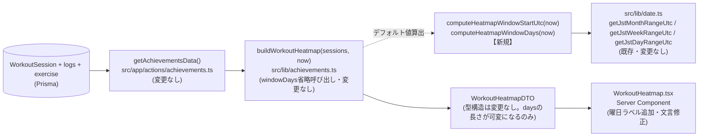
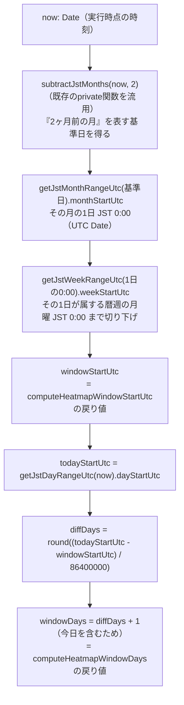
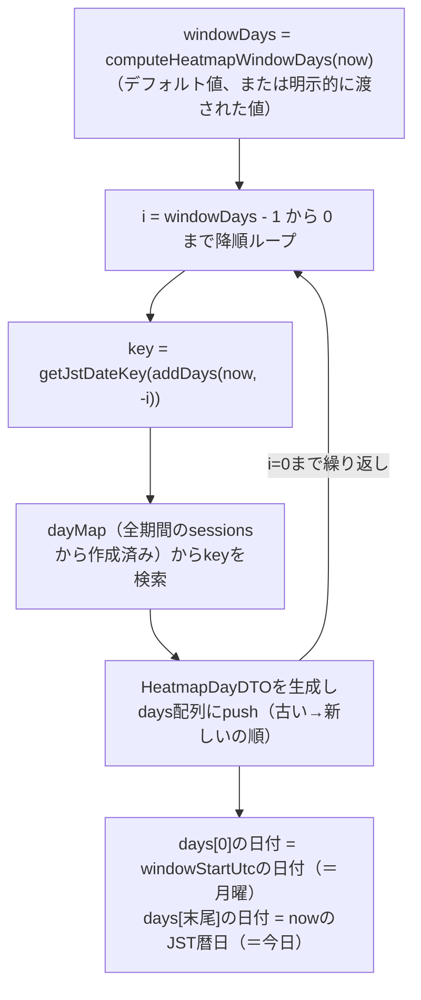
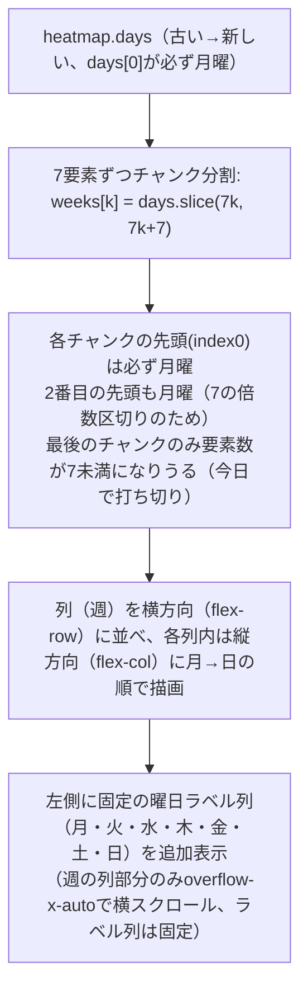

# 基本設計書: トレーニングカレンダーの月曜始まり週整列＋表示期間「当月＋過去2ヶ月」化

前提ドキュメント:
- `requirements.md`（本プロジェクト内。確定事項A〜Eを前提とする）
- 情報収集レポート: `C:\project\MuscleBoost\.project\research\topics\2026-09-15-2347-heatmap-monday-3months.md`

## 1. 全体アーキテクチャ

既存の実績画面（`/workouts`）のデータフローは変更しない。`getAchievementsData()`（Server Action）が全期間の`WorkoutSession`を1回取得し、`src/lib/achievements.ts`の純粋関数群に処理を委譲する構造はそのまま維持する。本プロジェクトの変更は、その中の**`buildWorkoutHeatmap`が使う「表示日数（windowDays）のデフォルト値をどう決めるか」という1点**に閉じている。



- `getAchievementsData()`は`buildWorkoutHeatmap(input, now)`を**引数`windowDays`を渡さずに**呼び出している（`src/app/actions/achievements.ts:47`）。このため、`windowDays`のデフォルト値だけを変更すれば、呼び出し元・Server Action層は一切変更不要という設計上の利点をそのまま活用する。
- `currentStreak`/`longestStreak`/`totalActiveDays`の計算、`buildTrendSeries`/`buildMuscleGroupBalance`/`buildPersonalBests`/`buildAchievementBadges`は本変更の対象外であり、データフロー図にも変更を加えない（情報収集レポートで確認済みの「表示ウィンドウ非依存」という性質をそのまま設計に反映する）。

## 2. モジュール分割

| モジュール | 変更種別 | 責務 |
|---|---|---|
| `src/lib/date.ts` | 変更なし | JST安全な日付境界計算のプリミティブ（`getJstDayRangeUtc`, `getJstWeekRangeUtc`, `getJstMonthRangeUtc`等）を提供。既存関数をそのまま再利用する。 |
| `src/lib/achievements.ts` | **変更** | `computeHeatmapWindowStartUtc`/`computeHeatmapWindowDays`を新規追加。`HEATMAP_WINDOW_DAYS`定数を削除。`buildWorkoutHeatmap`のデフォルト引数のみ変更（本体ロジックは無変更）。 |
| `src/app/actions/achievements.ts` | 変更なし | `buildWorkoutHeatmap(input, now)`の呼び出し方は現状のまま。 |
| `src/types/index.ts` | **変更**（コメントのみ） | `WorkoutHeatmapDTO`のJSDocコメントを可変長表示期間に即した内容に修正。型構造は不変。 |
| `src/components/WorkoutHeatmap.tsx` | **変更** | 曜日ラベル列の追加、フッター文言修正、冒頭コメント修正。グリッド生成ロジック（`slice(i, i+7)`）自体は不変。 |
| `tests/unit/achievements.test.ts` | **変更** | `toHaveLength(371)`の更新、月またぎ・年またぎの新規境界値テスト追加。 |

新規ファイルの追加は無い（既存5ファイルの変更のみで完結する）。

## 3. 新しいグリッド生成ロジックの処理フロー

### 3.1 表示グリッドの開始日・日数の算出（`computeHeatmapWindowStartUtc` / `computeHeatmapWindowDays`）



- ステップB〜Dは、`requirements.md`「確定事項A」の算出式そのものであり、いずれも`src/lib/date.ts`の既存エクスポート関数と、`src/lib/achievements.ts`に既存のprivate関数`subtractJstMonths`のみを使う（新規のTZ計算ロジックは一切書かない）。
- `windowStartUtc`は必ず「JST 0:00（月曜日）」に整列した値になる（`getJstWeekRangeUtc`の戻り値がその性質を保証する）。

### 3.2 `buildWorkoutHeatmap`内の`days`配列生成（既存ロジック、変更なし）



- `buildWorkoutHeatmap`のループ本体（`for (let i = windowDays - 1; i >= 0; i--) { ... }`）は、`windowDays`の値がどう決まったかに関わらず「今日を含めてwindowDays日前から今日まで」を生成するだけの汎用ロジックであるため、**本体コードの変更は一切不要**。`windowDays`のデフォルト値の算出方法だけを差し替えることで、結果的に`days[0]`が常に月曜になる（3.1節の`windowStartUtc`と一致する）。

### 3.3 UIグリッド描画（`WorkoutHeatmap.tsx`、チャンク分割ロジックは既存のまま）



- 重要な不変条件: `heatmap.days`の要素数は必ずしも7の倍数にならない（最後の週＝今週が今日の曜日までしか埋まっていないため）が、**チャンクの区切り位置（0, 7, 14, ...）は常に「月曜」に一致する**ため、最後のチャンクが1〜7要素のいずれであっても、その先頭は必ず月曜であり、曜日ラベル（月〜日）との縦位置の対応は崩れない。この性質により、`WorkoutHeatmap.tsx`のチャンク分割ロジック自体（`slice(i, i+7)`）を変更する必要がない。

## 4. I/F定義（新規／変更関数のシグネチャ）

```ts
// src/lib/achievements.ts（新規エクスポート）
export function computeHeatmapWindowStartUtc(now: Date): Date;
export function computeHeatmapWindowDays(now: Date): number;

// src/lib/achievements.ts（デフォルト引数のみ変更、シグネチャ自体は不変）
export function buildWorkoutHeatmap(
  sessions: AchievementSessionInput[],
  now: Date,
  windowDays: number = computeHeatmapWindowDays(now) // 変更前: HEATMAP_WINDOW_DAYS(=371)
): WorkoutHeatmapDTO;
```

- `WorkoutHeatmapDTO`/`HeatmapDayDTO`（`src/types/index.ts`）の型構造（フィールド名・型）は変更しない。`days`配列の要素数が可変長になる点のみが意味的な変更であり、コメントのみ更新する。
- `WorkoutHeatmap.tsx`のprops（`WorkoutHeatmapProps { heatmap: WorkoutHeatmapDTO }`）も変更しない。

## 5. 変更が及ばない領域（明示）

- `currentStreak`/`longestStreak`の計算（`dayMap`・`dayIndexSet`ベース、全期間対象）: 表示ウィンドウと無関係のため無変更。
- `buildTrendSeries`（週別12件・月別6件）、`buildMuscleGroupBalance`（直近90日）、`buildPersonalBests`、`buildAchievementBadges`: 本変更のスコープ外。`MUSCLE_BALANCE_WINDOW_DAYS = 90`等の他の定数と混同しないこと。
- `prisma/schema.prisma`: スキーマ変更なし（既存の全件取得クエリのまま）。
- `src/app/actions/achievements.ts`: `buildWorkoutHeatmap(input, now)`の呼び出しコード自体は無修正（デフォルト引数の変更のみで反映されるため）。

## 6. 将来課題（本プロジェクトのスコープ外として明記）

- 月ラベル（列の上に「7月」「8月」「9月」等を表示する機能）: `requirements.md`確定事項Cの通り、本プロジェクトでは実装しない。
- 月曜切り下げではみ出た前月分のセルを視覚的に区別する（薄い色にする等）UI改善: `requirements.md`確定事項Bの通り、本プロジェクトでは対応しない。
